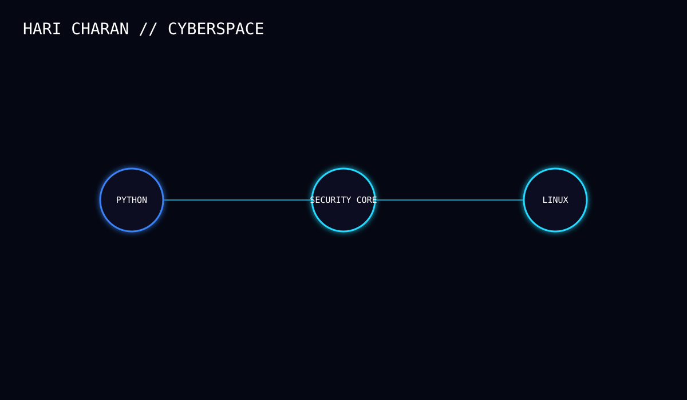

# HARI CHARAN

Cybersecurity • Python • Linux • Networking

## SYSTEM PROFILE

- Focus: Cybersecurity
- Primary: Python
- Environment: Linux
- Interests: Networking, Web Security, Security Research
- Status: Learning & Experimenting

## SKILLS

Python · Java · SQL · Linux · Git · GitHub · Termux

## CURRENTLY BUILDING

- Cybersecurity tooling
- Linux security workflows
- Practical security experiments
