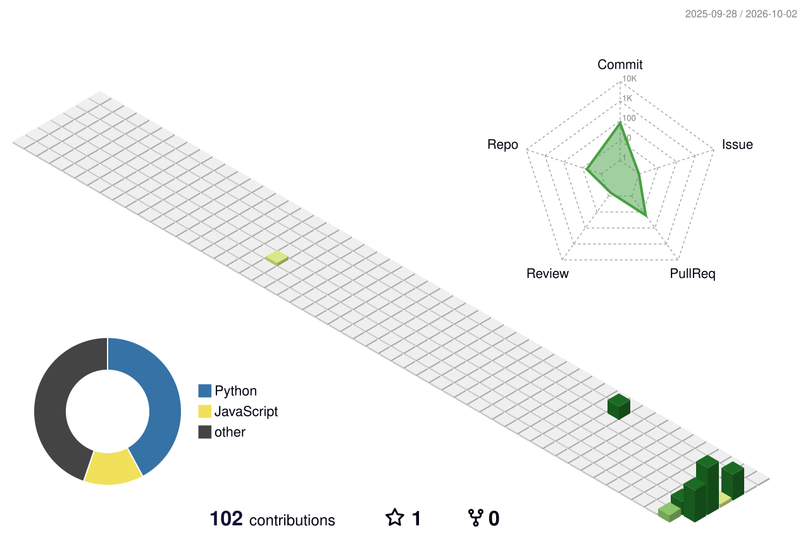

<div align="center">


<a href="https://github.com/Haricharan-20"></a>

<br/>


</div>

---

## 🧬 ABOUT ME

Computer Science & Engineering diploma student focused on cybersecurity, Linux, networking, and practical security research.

- 🔐 Exploring web security, defensive tooling, and security workflows
- 🐧 Building hands-on Linux and Termux projects
- 🧠 Learning AI/ML alongside my cybersecurity track
- 🧪 Turning experiments into documented, usable tools
- 🎯 Long-term direction: cybersecurity engineering and security research

## ⚙️ CURRENT FOCUS

```text
SECURITY   [ web security • networking • research ]
BUILDING   [ tools • automation • experiments ]
STACK      [ Python • Java • SQL • Linux ]
MODE       [ learn → test → document → improve ]
```

## 🛠️ TECH STACK

<p align="center">
  
</p>
## 🔥 WHAT I BUILD

<table>
<tr>
<td width="50%">

**🔒 Security**

Web security • networking • incident response • security experiments

</td>
<td width="50%">

**💻 Development**

Python • Java • SQL • Linux tooling • automation

</td>
</tr>
</table>

## 📊 LIVE GITHUB

<div align="center">

<a href="https://github.com/Haricharan-20">

</a>

<a href="https://github.com/Haricharan-20">

</a>

</div>

<p align="center">

</p>

## 🔥 CONTRIBUTION STREAK

<p align="center">

</p>
## 🛰️ ACTIVITY

<p align="center">

</p>

## 🧊 3D CONTRIBUTIONS

<p align="center">
<picture>
<source media="(prefers-color-scheme: dark)" srcset="./profile-3d-contrib/profile-green-animate.svg"/>
<source media="(prefers-color-scheme: light)" srcset="./profile-3d-contrib/profile-green.svg"/>

</picture>
</p>

## 🐍 CONTRIBUTION SNAKE

<p align="center">
<picture>
<source media="(prefers-color-scheme: dark)" srcset="./github-snake-dark.svg"/>
<source media="(prefers-color-scheme: light)" srcset="./github-snake.svg"/>

</picture>
</p>

## 🚀 FEATURED PROJECTS

<p align="center">
<a href="https://github.com/Haricharan-20/LEAF"></a>
<a href="https://github.com/Haricharan-20/cryptography-algorithms-implementation"></a>
<a href="https://github.com/Haricharan-20/incident-response-playbook"></a>
</p>

### What I am building

Security tooling · Linux workflows · automation · practical research · interactive developer experiences

## 📌 FIND ME

<p align="center">
<a href="https://github.com/Haricharan-20"></a>
</p>
## 🧬 GITHUB METRICS

<p align="center">

</p>

## 🌐 PROFILE SIGNAL

<p align="center">
`SECURITY`　`PYTHON`　`LINUX`　`NETWORKING`　`RESEARCH`
</p>

<div align="center">

</div>
## 🏆 ACHIEVEMENTS

<p align="center">

</p>
